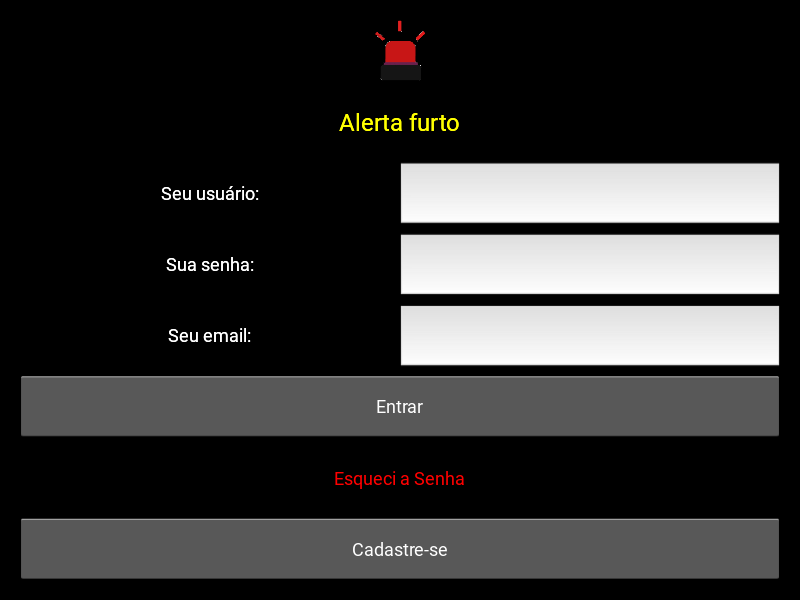

# LoginKivy

Aplicativo "Alerta Furto" criado utilizando kivy, com interface simples.

## Funcionalidades

    Use os operadores básicos e calcule suas contas.

## Pré-requisitos

### Certifique-se de ter o seguinte instalado antes de começar:
  
     Python 3
     Kivy

## Instalação e Uso

1. Baixe de acordo com sua plataforma:

    - Windows x64: 
    - Linux x86_64: 
    - Apk: Em breve.

2. Ou siga os seguintes passos:

- Clone o repositório:

        git clone https://github.com/Louiexz/LoginKivy.git
        cd LoginKivy
 
 - Instale as dependências:

        pip install -r requirements.txt

 - Execute o aplicativo:

        python run.py

## Estrutura do Projeto

    LoginKivy/
    │
    ├── run.py           # Arquivo principal do aplicativo
    ├── assets/             # Diretório contendo arquivos necessários
    |   ├── scripts/           # Diretório contendo funções e/ou classes
    │   |   ├── functs/           # Diretório de funções
    |   |   |   ├── account.kv       # Conexão de conta para redefinição de senha
    |   |   |   └── tratarJson.py    # Abre, salva ou valida contas no json's
    |   |   └── screenDirectory/  # Diretório de telas
    |   |       ├── loginFiles/      # Diretório com classe e interface da tela de login
    |   |       └── homeFiles/       # Diretório com classe e interface da tela home 
    │   ├── json/              # Diretório de arquivos json utilizados
    |   └── images/            # Diretório contendo images
    └── requirements.txt  # Arquivo contendo as dependências do Python

## Contribuições
Louiexz - Autor e Desenvolvedor da Alerta Furto 

Contribuições são bem-vindas! Sinta-se à vontade para abrir issues ou pull requests.
- main.py
- screenapp.kv
- assets/
  - scripts/
    - screenDirectory/
      - loginFiles/
        - login.py
        - login.kv
      - homeFiles/
        - home.py
        - home.kv
